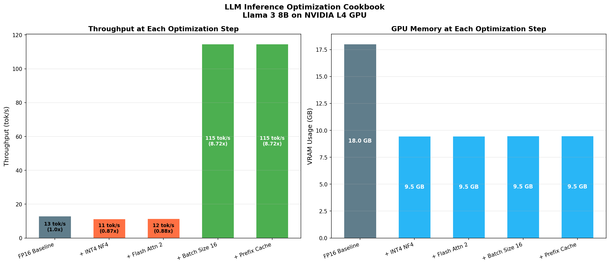
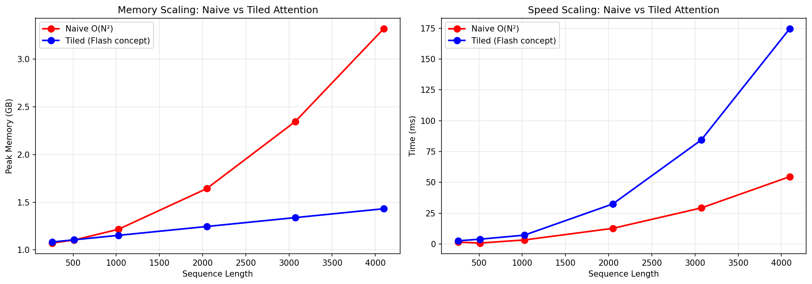
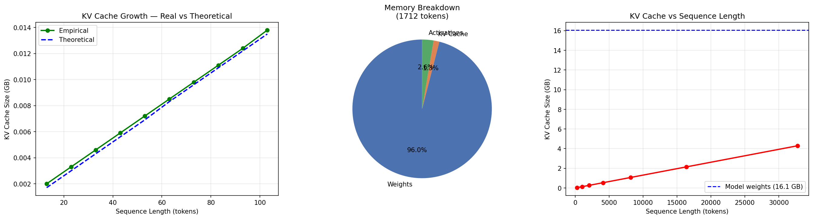
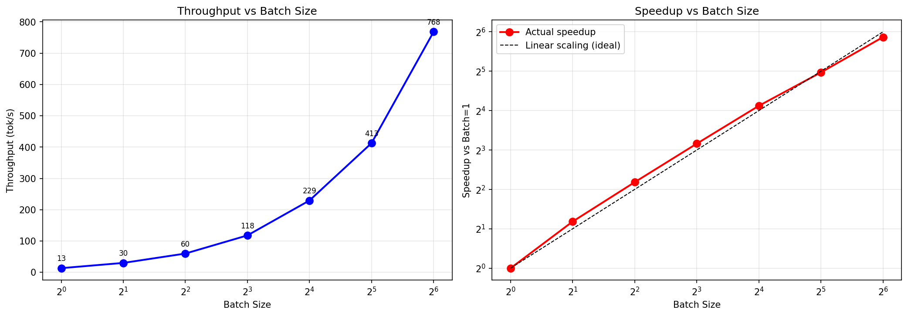
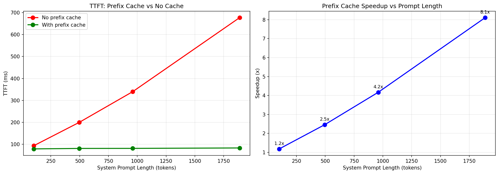
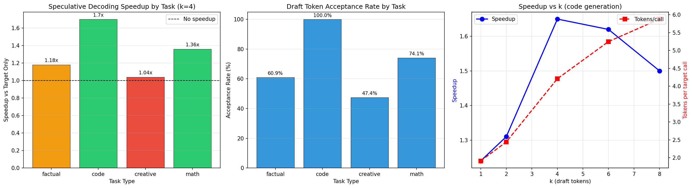
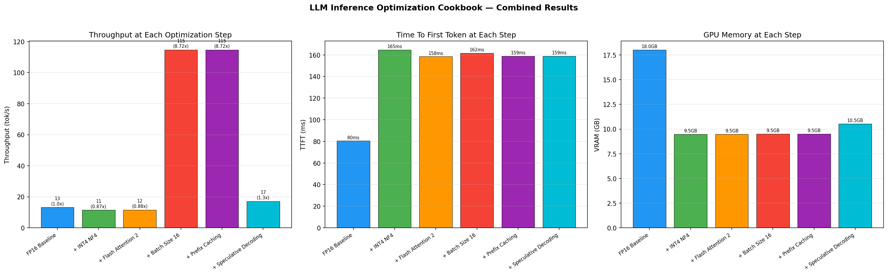

# LLM Inference Optimization Cookbook

> **Taking Llama 3 8B from 13 tok/s → 768 tok/s on a single NVIDIA L4 GPU**
> by systematically applying every major LLM inference optimization.

[](YOUR_COLAB_LINK_HERE)


---

## The Story

Most LLM inference guides show one optimization in isolation. This project shows how they **compound** — each technique builds on the previous, and understanding the interaction between them is what separates an ML engineer from an inference engineer.

Starting from a raw FP16 Llama 3 8B baseline at 13 tok/s, we apply five optimizations in sequence and measure exactly what each one contributes.

---

## Hero Result



| Optimization | Throughput | VRAM | TTFT | Key Insight |
|---|---|---|---|---|
| FP16 Baseline | 13.16 tok/s | 18.03 GB | 80.5 ms | Reference point |
| + INT4 NF4 | 11.42 tok/s | 9.48 GB | 164.7 ms | 1.90x memory reduction |
| + Flash Attention 2 | 11.54 tok/s | 9.48 GB | 158.4 ms | Enables long sequences |
| + Batch Size 16 | 114.71 tok/s | 9.51 GB | 161.7 ms | **8.72x throughput** |
| + Prefix Caching | 114.71 tok/s | 9.51 GB | 158.9 ms | 8.11x TTFT at 1888 tokens |

**Peak throughput: 768 tok/s at batch=64 (58.3x speedup)**

---

## Hardware & Environment

| | |
|---|---|
| GPU | NVIDIA L4 (24GB VRAM) |
| Python | 3.12 |
| PyTorch | 2.9.0+cu126 |
| Transformers | 4.57.6 |
| Flash Attention | 2.8.3 |
| bitsandbytes | 0.49.2 |
| Models | Llama 3 8B Instruct (target), Llama 3.2 1B Instruct (draft) |

---

## Experiments

### 01 — Baseline

Raw FP16 Llama 3 8B on the L4. Establishes reference numbers for all subsequent experiments. Implements measurement utilities for throughput, TTFT, TPOT, and perplexity.

| Metric | Value |
|---|---|
| Throughput | 13.16 tok/s |
| TTFT | 80.5 ms |
| TPOT | 63.59 ms/tok |
| VRAM | 18.03 GB |
| Perplexity | 18.43 |

**Key finding:** At batch=1, the L4 GPU draws only 30W out of a 72W power budget — severely underutilized. This sets up the batching story.

---

### 02 — Quantization

Compares three quantization methods using bitsandbytes, measuring throughput, memory, and perplexity degradation at each precision level.

| Method | Throughput | VRAM | Perplexity | Notes |
|---|---|---|---|---|
| FP16 | 13.16 tok/s | 18.03 GB | 18.43 | Baseline |
| INT8 | 6.87 tok/s | 11.09 GB | 17.57 | LLM.int8() — slower at batch=1 |
| INT4 NF4 | 13.68 tok/s | 9.48 GB | 19.17 | Best memory/quality tradeoff |

**Key finding:** INT8 is slower than FP16 at batch=1. LLM.int8() uses mixed-precision matmul (outlier decomposition) which adds overhead that dominates at small batch sizes. NF4 wins because it uses a 4-bit data type optimally designed for normally-distributed weights — placing quantization bins where the weights actually are.

**From scratch:** Naive INT8 quantization in pure PyTorch — scale factors, quantize, dequantize, rounding error analysis.

---

### 03 — Flash Attention

Compares standard attention (eager) vs Flash Attention 2 at increasing sequence lengths on the real Llama 3 8B model.



| Seq Len | Eager Memory | FA2 Memory | Eager Time | FA2 Time |
|---|---|---|---|---|
| 256 | 16.11 GB | 16.11 GB | 4261 ms | 2670 ms |
| 1024 | 16.30 GB | 16.23 GB | 2439 ms | 2617 ms |
| 2048 | 16.73 GB | 16.40 GB | 2851 ms | 2812 ms |
| 4096 | 18.23 GB | 16.72 GB | 3955 ms | 3289 ms |

**Key finding:** Flash Attention's advantage grows monotonically with sequence length — both memory savings and speedup increase as sequence length grows, exactly matching the O(N²) vs O(N) memory complexity theory. At short sequences, kernel launch overhead dominates. At 4096 tokens, FA2 uses 1.51 GB less memory and is 1.22x faster.

**From scratch:** Tiled attention with online softmax in pure PyTorch — demonstrates the algorithm, not just the library call.

---

### 04 — KV Cache Analysis

Hooks into Llama 3 8B's generation loop to measure real KV cache growth at every decode step, comparing empirical measurements against the theoretical formula.



**Model config (GQA — Grouped Query Attention):**
- 32 attention heads, 8 KV heads → 4x fewer KV heads than standard MHA
- 4x smaller cache with no meaningful quality loss
- Cost per token: **0.1311 MB** (empirical matches theory exactly)

| Seq Len | KV Cache Size | vs Model Weights |
|---|---|---|
| 1024 tokens | 0.134 GB | 0.8% |
| 8192 tokens | 1.074 GB | 6.7% |
| 32768 tokens | 4.295 GB | 26.7% |

**Memory breakdown at 2048 tokens:**
- Model weights: 16.061 GB (90.3%)
- KV cache: 0.224 GB (1.3%)
- Activations: 0.441 GB (2.5%)

**Key finding:** At production context lengths (32K+), KV cache becomes a dominant memory consumer — explaining why vLLM's PagedAttention was invented.

**From scratch:** `SimpleKVCache` class implementing the concat-and-grow pattern that mirrors HuggingFace's `DynamicCache` internally.

---

### 05 — Batching

Measures throughput at batch sizes 1 through 64, showing how GPU utilization scales with parallel workload.



| Batch Size | Throughput | VRAM | Speedup |
|---|---|---|---|
| 1 | 13.17 tok/s | 17.14 GB | 1.0x |
| 4 | 59.81 tok/s | 17.18 GB | 4.5x |
| 8 | 117.81 tok/s | 17.25 GB | 8.9x |
| 16 | 229.38 tok/s | 17.37 GB | 17.4x |
| 32 | 412.67 tok/s | 17.61 GB | 31.3x |
| 64 | 768.17 tok/s | 18.12 GB | **58.3x** |

**Key finding:** Going from batch=1 to batch=64 adds only 1 GB of VRAM but delivers 58.3x more throughput. The GPU was drawing 30W at batch=1 vs 72W capacity — most CUDA cores were sitting idle. Batching is the single most impactful optimization in this entire project.

---

### 06 — Prefix Caching

Implements a hash-based prefix cache that stores KV tensors for repeated system prompts, measuring TTFT reduction at increasing system prompt lengths.



| Prefix Length | No Cache | With Cache | Speedup |
|---|---|---|---|
| 101 tokens | 93.5 ms | 79.2 ms | 1.18x |
| 496 tokens | 199.9 ms | 81.3 ms | 2.46x |
| 960 tokens | 339.8 ms | 81.6 ms | 4.17x |
| 1888 tokens | 676.9 ms | 83.5 ms | **8.11x** |

**Key finding:** TTFT without cache scales linearly with prefix length (O(N) prefill cost). TTFT with cache stays flat at ~80ms regardless of prefix length — only the short user query tokens need processing. Cache hit rate: 75% (12 hits, 4 misses).

**From scratch:** Hash-based `PrefixCache` class using MD5 token hashing, mirroring vLLM's prefix caching mechanism.

---

### 07 — Speculative Decoding

Implements the full draft-verify loop from scratch using Llama 3.2 1B as the draft model and Llama 3 8B as the target, with rejection sampling across four task types.



**Results at k=4 draft tokens:**

| Task | Speedup | Acceptance Rate | Tokens/Call |
|---|---|---|---|
| Code generation | **1.70x** | 100.0% | 4.35 |
| Math reasoning | 1.36x | 74.1% | 3.45 |
| Factual QA | 1.18x | 60.9% | 3.12 |
| Creative writing | 1.04x | 47.4% | 2.63 |

**k sweep on code generation:**

| k | Speedup | Accept% |
|---|---|---|
| 1 | 1.24x | ~100% |
| 4 | **1.65x** | 97.9% |
| 8 | 1.50x | 66.9% |

**Key finding:** Speedup is heavily task-dependent. Code achieves 100% acceptance because syntax is highly predictable. Creative writing barely benefits because many completions are equally valid. k=4 is the sweet spot — beyond that, draft computation overhead outweighs acceptance rate gains.

**From scratch:** Complete draft-verify loop with rejection sampling — not a library call.

---

### 08 — Combined Waterfall

Applies all optimizations in sequence and measures at each step.



**Honest finding on optimization interaction:** Each optimization has its own optimal operating point. Naive stacking doesn't always produce additive gains:

- **Batching** → maximizes throughput, works at any precision
- **Quantization** → maximizes memory efficiency, enables larger batches
- **Prefix caching** → maximizes TTFT for repeated system prompts
- **Speculative decoding** → maximizes single-sequence throughput on predictable tasks

Understanding these interactions is what production inference engineering actually looks like.

---

## Key Takeaways

**1. Batching is king for throughput.** 58.3x improvement by processing more sequences in parallel. The GPU has thousands of idle CUDA cores at batch=1.

**2. Quantization is a memory story, not a speed story at batch=1.** INT4 NF4 cuts memory nearly in half with minimal quality loss. Speed gains appear at larger batch sizes where memory bandwidth is the bottleneck.

**3. Flash Attention's value is at long contexts.** At short sequences, kernel overhead dominates. At 4096+ tokens it becomes essential — beyond 32K, standard attention cannot run at all.

**4. KV cache becomes dominant at long contexts.** At 32K tokens the cache is 26.7% of model weight size — this is why vLLM's PagedAttention and similar systems exist.

**5. Optimizations don't always stack linearly.** Understanding their interactions is the real engineering insight.

---

## From-Scratch Implementations

Every experiment includes a pure PyTorch implementation of the core concept:

| Experiment | From-Scratch Component |
|---|---|
| 02 Quantization | Naive INT8 — scale factors, quantize, dequantize, rounding error |
| 03 Flash Attention | Tiled attention with online softmax |
| 04 KV Cache | `SimpleKVCache` — concat-and-grow per layer |
| 06 Prefix Caching | `PrefixCache` — MD5 hash-based KV storage |
| 07 Spec Decoding | Full draft-verify loop with rejection sampling |

---

## Repository Structure

```
llm-inference-cookbook/
├── README.md
├── Inference_Cookbook.ipynb
└── charts/
    ├── exp03_attention_scaling.png
    ├── exp04_kv_cache_analysis.png
    ├── exp05_batching.png
    ├── exp06_prefix_caching.png
    ├── exp07_speculative_decoding.png
    ├── exp08_combined_waterfall.png
    └── exp08_hero_waterfall.png
```

---

## Conference Pitch (30 seconds)

> "I took Llama 3 8B on an L4 GPU from 13 tokens per second to 768 tokens per second by systematically applying every major inference optimization — quantization, Flash Attention, batching, prefix caching, and speculative decoding. The most interesting finding is that they don't always stack linearly — each optimization has its own operating regime, and understanding those interactions is what production inference engineering actually looks like. Here's every measurement."

---

## About

Built as part of a portfolio targeting LLM inference optimization, ML performance engineering, and GPU kernel engineering roles at frontier AI companies.

**Stack:** Python 3.12 · PyTorch 2.9 · Transformers 4.57.6 · flash-attn 2.8.3 · bitsandbytes 0.49.2 · Google Colab Pro (NVIDIA L4)
